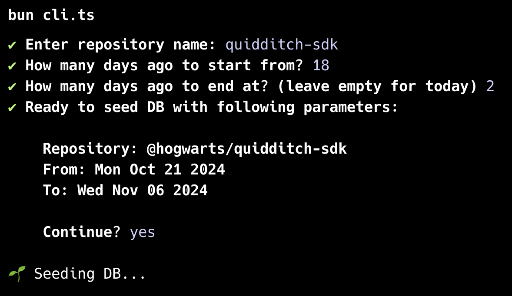

# Bitbucket Stats

A CLI tool that crawls your Bitbucket repository's pull requests, comments, and review data, storing everything in a local SQLite database for statistical analysis.

## Quick Start

```bash
# Create .env file and fill in Bitbucket credentials
cp .env.example .env

# Install dependencies
bun install

# Initialize the database
bun db:push

# Run the CLI tool
bun cli
```



Follow the prompts to select your repository and date range. The script will then:

1. Fetch all pull requests within the specified time range
2. Collect associated comments, reviewers, and PR participants
3. Store everything in a local SQLite database

You can then use this data for various analyses like code review patterns, team collaboration metrics, or pull request lifecycle statistics.

```bash
# Open the database in a GUI
bun db:studio
```

## Resources

- [Bun - A fast all-in-one JavaScript runtime](https://bun.sh/)
- [Drizzle ORM - SQLite Getting Started Guide](https://orm.drizzle.team/docs/get-started/sqlite-new)
- [Bitbucket REST API - Pull Requests Documentation](https://developer.atlassian.com/cloud/bitbucket/rest/api-group-pullrequests/#api-group-pullrequests)
